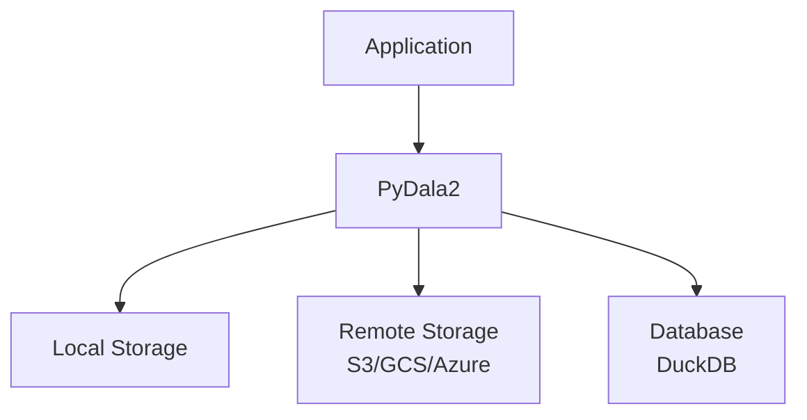
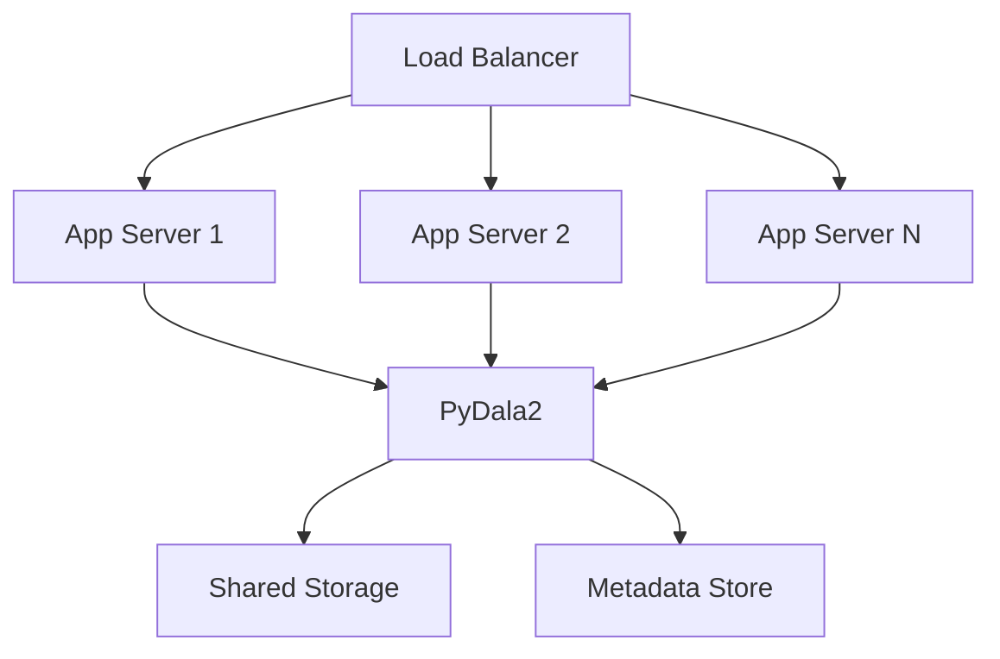

# Deployment Guide

This guide covers deployment considerations and best practices for running PyDala2 in production environments.

## Architecture Overview

### Single Node Deployment



### Distributed Deployment



## System Requirements

### Minimum Requirements

- **Python**: 3.8 or higher
- **Memory**: 4GB RAM minimum
- **Storage**: 10GB free space
- **CPU**: 2 cores minimum

### Recommended Requirements

- **Python**: 3.9 or higher
- **Memory**: 16GB RAM or more
- **Storage**: SSD with 100GB+ free space
- **CPU**: 4+ cores
- **Network**: Gigabit Ethernet for cloud storage

## Installation

### Production Installation

```bash
# Create virtual environment
python -m venv pydala2_env
source pydala2_env/bin/activate

# Install with all dependencies
pip install pydala2[all]

# Or install specific components
pip install pydala2[polars,duckdb,pandas]
```

### Docker Deployment

```dockerfile
FROM python:3.9-slim

WORKDIR /app

# Install system dependencies
RUN apt-get update && apt-get install -y \
    gcc \
    g++ \
    && rm -rf /var/lib/apt/lists/*

# Install Python dependencies
COPY requirements.txt .
RUN pip install --no-cache-dir -r requirements.txt

# Copy application
COPY . .

# Set environment variables
ENV PYDALA2_CACHE_DIR=/cache
ENV PYDALA2_LOG_LEVEL=INFO

# Create cache directory
RUN mkdir -p /cache

# Run application
CMD ["python", "app.py"]
```

### Kubernetes Deployment

```yaml
apiVersion: apps/v1
kind: Deployment
metadata:
  name: pydala2-app
spec:
  replicas: 3
  selector:
    matchLabels:
      app: pydala2
  template:
    metadata:
      labels:
        app: pydala2
    spec:
      containers:
      - name: app
        image: pydala2-app:latest
        resources:
          requests:
            memory: "1Gi"
            cpu: "500m"
          limits:
            memory: "4Gi"
            cpu: "2"
        env:
        - name: PYDALA2_CACHE_DIR
          value: "/cache"
        - name: PYDALA2_MAX_MEMORY
          value: "4294967296"
        volumeMounts:
        - name: cache-volume
          mountPath: /cache
      volumes:
      - name: cache-volume
        emptyDir:
          sizeLimit: 10Gi
```

## Configuration

### Environment Variables

```bash
# Core configuration
export PYDALA2_DEFAULT_BACKEND=polars
export PYDALA2_CACHE_ENABLED=true
export PYDALA2_CACHE_DIR=/tmp/pydala2_cache
export PYDALA2_CACHE_MAX_SIZE=4294967296  # 4GB
export PYDALA2_LOG_LEVEL=INFO

# Performance tuning
export PYDALA2_MAX_MEMORY=8589934592  # 8GB
export PYDALA2_N_WORKERS=4
export PYDALA2_IO_THREADS=8

# Cloud storage
export AWS_ACCESS_KEY_ID=your_access_key
export AWS_SECRET_ACCESS_KEY=your_secret_key
export AWS_DEFAULT_REGION=us-east-1
export GOOGLE_APPLICATION_CREDENTIALS=/path/to/service-account.json
```

### Configuration File

```python
# config.py
from pydala import set_config

# Production configuration
PROD_CONFIG = {
    'default_backend': 'polars',
    'cache_enabled': True,
    'cache_max_size': 8 * 1024 * 1024 * 1024,  # 8GB
    'cache_ttl': 3600,  # 1 hour
    'max_memory': 16 * 1024 * 1024 * 1024,  # 16GB
    'n_workers': 8,
    'io_threads': 16,
    'compression': 'zstd',
    'compression_level': 3,
    'row_group_size': 1000000,
    'validate_schema': True,
    'enable_profiling': True,
    'log_level': 'INFO'
}

# Apply configuration
set_config(PROD_CONFIG)
```

## Storage Configuration

### Local Storage

```python
# High-performance local storage
from pydala import ParquetDataset

dataset = ParquetDataset(
    "/data/production",
    cached=True,
    cache_storage="/fast_ssd/cache",
    filesystem_kwargs={
        'auto_mkdir': True,
        'use_listings_cache': True,
        'listings_expiry_time': 300
    }
)
```

### S3 Configuration

```python
# Production S3 setup
from pydala import ParquetDataset, FileSystem

# Optimized S3 filesystem
s3_fs = FileSystem(
    protocol="s3",
    bucket="production-data",
    cached=True,
    cache_storage="/s3_cache",
    client_kwargs={
        "region_name": "us-east-1",
        "endpoint_url": "https://s3.us-east-1.amazonaws.com"
    },
    config_kwargs={
        "max_pool_connections": 50,
        "retry_mode": "adaptive"
    }
)

dataset = ParquetDataset(
    "s3://production-data/sales",
    filesystem=s3_fs,
    cached=True
)
```

### GCS Configuration

```python
# GCS with service account
gcs_fs = FileSystem(
    protocol="gcs",
    bucket="production-data",
    cached=True,
    cache_storage="/gcs_cache",
    token="/secrets/gcp-service-account.json",
    project="my-project"
)
```

## Performance Optimization

### Caching Strategy

```python
# Multi-level caching
import os
from pydala import set_config

# Configure tiered caching
set_config({
    'cache_enabled': True,
    'cache_max_size': 8 * 1024 * 1024 * 1024,  # 8GB total
    'cache_storage': {
        'level1': '/dev/shm/pydala2',  # Memory cache
        'level2': '/fast_ssd/cache',   # SSD cache
        'level3': '/slow_hdd/cache'    # HDD cache
    }
})
```

### Connection Pooling

```python
# Reuse connections across operations
from pydala import Catalog, ParquetDataset
import duckdb

# Shared DuckDB connection
ddb_con = duckdb.connect()

# Configure for high concurrency
ddb_con.execute("SET threads=8")
ddb_con.execute("SET memory_limit='8GB'")
ddb_con.execute("SET enable_object_cache=true")

# Use in multiple datasets
catalog = Catalog("catalog.yaml", ddb_con=ddb_con)
dataset1 = ParquetDataset("data1", ddb_con=ddb_con)
dataset2 = ParquetDataset("data2", ddb_con=ddb_con)
```

### Memory Management

```python
# Monitor and manage memory usage
import psutil
from pydala import get_memory_usage

def check_memory():
    """Check memory usage and take action if needed."""
    mem = get_memory_usage()
    usage_percent = mem['used'] / mem['total'] * 100

    if usage_percent > 90:
        print(f"High memory usage: {usage_percent:.1f}%")
        # Clear caches
        clear_all_caches()
        # Trigger garbage collection
        import gc
        gc.collect()

def clear_all_caches():
    """Clear all PyDala2 caches."""
    from pydala.filesystem import clear_cache
    clear_cache()
```

## Monitoring and Logging

### Structured Logging

```python
# Configure structured logging
import logging
import json
from datetime import datetime

class JSONFormatter(logging.Formatter):
    def format(self, record):
        log_entry = {
            'timestamp': datetime.utcnow().isoformat(),
            'level': record.levelname,
            'message': record.getMessage(),
            'module': record.module,
            'function': record.funcName,
            'line': record.lineno
        }
        if hasattr(record, 'extra'):
            log_entry.update(record.extra)
        return json.dumps(log_entry)

# Set up logger
logger = logging.getLogger('pydala2')
handler = logging.StreamHandler()
handler.setFormatter(JSONFormatter())
logger.addHandler(handler)
logger.setLevel(logging.INFO)
```

### Metrics Collection

```python
# Custom metrics collection
import time
from collections import defaultdict

class MetricsCollector:
    def __init__(self):
        self.metrics = defaultdict(list)

    def time_operation(self, operation_name):
        """Decorator to time operations."""
        def decorator(func):
            def wrapper(*args, **kwargs):
                start_time = time.time()
                try:
                    result = func(*args, **kwargs)
                    success = True
                except Exception as e:
                    success = False
                    raise e
                finally:
                    duration = time.time() - start_time
                    self.metrics[operation_name].append({
                        'duration': duration,
                        'success': success,
                        'timestamp': time.time()
                    })
                return result
            return wrapper
        return decorator

    def get_stats(self, operation_name):
        """Get statistics for an operation."""
        durations = [m['duration'] for m in self.metrics[operation_name]]
        if not durations:
            return None

        return {
            'count': len(durations),
            'avg': sum(durations) / len(durations),
            'min': min(durations),
            'max': max(durations),
            'p95': sorted(durations)[int(len(durations) * 0.95)]
        }

# Usage
metrics = MetricsCollector()

@metrics.time_operation('dataset_read')
def read_data():
    return dataset.read()
```

### Health Checks

```python
# Health check endpoint
from fastapi import FastAPI, HTTPException
from pydala import Catalog, ParquetDataset

app = FastAPI()

@app.get("/health")
async def health_check():
    """Health check endpoint."""
    try:
        # Check basic functionality
        catalog = Catalog("catalog.yaml")
        dataset = ParquetDataset("test_dataset")

        # Test read operation
        if dataset.exists():
            count = dataset.count_rows()

        return {
            "status": "healthy",
            "timestamp": datetime.utcnow().isoformat(),
            "version": "1.0.0"
        }
    except Exception as e:
        raise HTTPException(
            status_code=503,
            detail=f"Service unhealthy: {str(e)}"
        )
```

## Security

### Access Control

```python
# Implement access control
class AccessControl:
    def __init__(self):
        self.permissions = {}

    def check_access(self, user, resource, action):
        """Check if user has permission for action on resource."""
        key = f"{user}:{resource}"
        return self.permissions.get(key, {}).get(action, False)

    def grant_permission(self, user, resource, action):
        """Grant permission to user."""
        key = f"{user}:{resource}"
        if key not in self.permissions:
            self.permissions[key] = {}
        self.permissions[key][action] = True

# Usage
access_control = AccessControl()
access_control.grant_permission("analyst1", "sales_data", "read")

# Check before operation
if access_control.check_access(current_user, "sales_data", "read"):
    data = catalog.get_dataset("sales_data").read()
```

### Data Encryption

```python
# Client-side encryption
from cryptography.fernet import Fernet
import base64

class DataEncryptor:
    def __init__(self, key=None):
        if key:
            self.key = key
        else:
            self.key = Fernet.generate_key()
        self.cipher = Fernet(self.key)

    def encrypt_data(self, data):
        """Encrypt data."""
        if isinstance(data, str):
            data = data.encode()
        return self.cipher.encrypt(data)

    def decrypt_data(self, encrypted_data):
        """Decrypt data."""
        decrypted = self.cipher.decrypt(encrypted_data)
        return decrypted.decode()

# Usage in dataset operations
encryptor = DataEncryptor()

# Encrypt sensitive columns before writing
def write_encrypted(dataset, data, sensitive_columns):
    for col in sensitive_columns:
        data[col] = data[col].apply(encryptor.encrypt_data)
    dataset.write(data)

# Decrypt after reading
def read_decrypted(dataset, sensitive_columns):
    data = dataset.read()
    for col in sensitive_columns:
        data[col] = data[col].apply(encryptor.decrypt_data)
    return data
```

## Backup and Recovery

### Dataset Backup

```python
# Backup strategy
import shutil
from datetime import datetime
import tarfile

def backup_dataset(dataset_path, backup_dir):
    """Create a compressed backup of a dataset."""
    timestamp = datetime.now().strftime("%Y%m%d_%H%M%S")
    backup_name = f"backup_{timestamp}.tar.gz"
    backup_path = os.path.join(backup_dir, backup_name)

    with tarfile.open(backup_path, "w:gz") as tar:
        tar.add(dataset_path, arcname=os.path.basename(dataset_path))

    return backup_path

def restore_dataset(backup_path, restore_dir):
    """Restore a dataset from backup."""
    with tarfile.open(backup_path, "r:gz") as tar:
        tar.extractall(restore_dir)
```

### Catalog Backup

```python
# Backup catalog configuration
import yaml
from pathlib import Path

def backup_catalog(catalog_path, backup_dir):
    """Backup catalog configuration."""
    timestamp = datetime.now().strftime("%Y%m%d_%H%M%S")
    backup_path = Path(backup_dir) / f"catalog_backup_{timestamp}.yaml"

    # Read original catalog
    with open(catalog_path, 'r') as f:
        catalog_data = yaml.safe_load(f)

    # Add backup metadata
    catalog_data['_backup_metadata'] = {
        'timestamp': timestamp,
        'version': '1.0'
    }

    # Write backup
    with open(backup_path, 'w') as f:
        yaml.safe_dump(catalog_data, f, default_flow_style=False)

    return str(backup_path)
```

## Scaling Considerations

### Horizontal Scaling

```python
# Distributed catalog
from pydala import Catalog

class DistributedCatalog:
    def __init__(self, catalog_urls):
        self.catalogs = [Catalog(url) for url in catalog_urls]

    def get_dataset(self, name):
        """Get dataset from any available catalog."""
        for catalog in self.catalogs:
            try:
                return catalog.get_dataset(name)
            except:
                continue
        raise ValueError(f"Dataset {name} not found in any catalog")

# Usage
catalog_urls = [
    "http://catalog1:8000/catalog.yaml",
    "http://catalog2:8000/catalog.yaml",
    "http://catalog3:8000/catalog.yaml"
]
dist_catalog = DistributedCatalog(catalog_urls)
```

### Load Balancing

```python
# Round-robin dataset access
import itertools

class LoadBalancedDataset:
    def __init__(self, dataset_paths):
        self.datasets = [
            ParquetDataset(path)
            for path in dataset_paths
        ]
        self.cycle = itertools.cycle(self.datasets)

    def read(self, **kwargs):
        """Read from next dataset in rotation."""
        dataset = next(self.cycle)
        return dataset.read(**kwargs)

# Usage
lb_dataset = LoadBalancedDataset([
    "/data/replica1/sales",
    "/data/replica2/sales",
    "/data/replica3/sales"
])
```

## Deployment Checklist

- [ ] Configure appropriate caching strategy
- [ ] Set up monitoring and logging
- [ ] Implement security controls
- [ ] Create backup procedures
- [ ] Test disaster recovery
- [ ] Configure alerting
- [ ] Document deployment process
- [ ] Set up CI/CD pipeline
- [ ] Perform load testing
- [ ] Optimize for specific workload