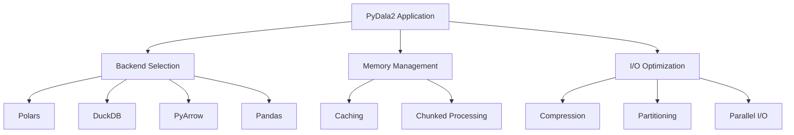

# Performance Tuning

This guide covers advanced performance tuning techniques for PyDala2.

## Performance Architecture



## Backend Optimization

### Polars Performance

Polars is generally the fastest backend for data manipulation tasks.

#### Lazy Evaluation

```python
# Always use lazy evaluation for complex operations
lazy_df = dataset.table.to_polars(lazy=True)  # Returns LazyFrame by default

# Build up the query plan
result = (
    lazy_df
    .filter(pl.col("date") >= "2023-01-01")
    .group_by(["category", "region"])
    .agg([
        pl.count("id").alias("count"),
        pl.sum("amount").alias("total_amount"),
        pl.mean("amount").alias("avg_amount"),
        pl.col("amount").quantile(0.95).alias("p95_amount")
    ])
    .filter(pl.col("count") > 10)
    .sort("total_amount", descending=True)
    .collect()  # Execute here
)

# Or use the shortcut property
result = (
    dataset.t.pl  # Direct access to LazyFrame
    .filter(pl.col("date") >= "2023-01-01")
    .group_by(["category", "region"])
    .agg([
        pl.count("id").alias("count"),
        pl.sum("amount").alias("total_amount")
    ])
    .collect()
)
```

#### Query Optimization

```python
# Optimized aggregation patterns
def optimized_aggregation(df):
    """Optimized aggregation with proper types."""
    return (
        df
        # Filter early to reduce data size
        .filter(pl.col("status") == "completed")
        # Cast types early if needed
        .with_columns([
            pl.col("amount").cast(pl.Float64),
            pl.col("date").cast(pl.Date)
        ])
        # Group by cardinality order (low to high)
        .group_by(["region", "category", "subcategory"])
        .agg([
            # Use built-in aggregations when possible
            pl.count("id").alias("orders"),
            pl.sum("amount").alias("revenue"),
            # Use expressions for complex calcs
            (pl.col("amount") / pl.count("id")).alias("avg_order")
        ])
    )

# Use expressions for multiple calculations
result = (
    df
    .with_columns([
        # Single pass for multiple calculations
        (pl.col("amount") * 0.1).alias("tax"),
        (pl.col("amount") * 1.1).alias("total"),
        pl.col("amount").rank().alias("amount_rank")
    ])
)
```

#### Memory Optimization

```python
# Use PyDala2's built-in data type optimization
dataset.optimize.optimize_dtypes()

# Or manually optimize in Polars
def optimize_dtypes_polars(df):
    """Optimize Polars DataFrame memory usage."""
    return (
        df
        # Downcast numeric types
        .with_columns([
            pl.col("id").cast(pl.Int32),
            pl.col("small_int").cast(pl.Int16),
            pl.col("price").cast(pl.Float32),
            # Use categorical for low cardinality strings
            pl.col("category").cast(pl.Categorical),
            # Use dates instead of timestamps
            pl.col("date_only").cast(pl.Date)
        ])
    )

# Apply optimization to a LazyFrame
lazy_df = dataset.table.pl
optimized_df = lazy_df.with_columns([
    pl.col("amount").cast(pl.Float32),
    pl.col("category").cast(pl.Categorical)
])
result = optimized_df.collect()
```

### DuckDB Optimization

DuckDB excels at SQL queries and joins.

#### Query Optimization

```python
# Use DuckDB connection directly for SQL queries
def get_category_summary(dataset, category):
    """Get summary for a specific category."""
    return dataset.ddb_con.sql("""
        SELECT region, SUM(amount) as total
        FROM dataset
        WHERE category = ?
        GROUP BY region
    """, parameters=[category]).to_arrow()

# Optimize joins with proper indexing hints
join_result = dataset.ddb_con.sql("""
    SELECT /*+ HASH_JOIN(a, b) */
        a.*,
        b.customer_name,
        b.segment
    FROM dataset a
    JOIN customers b ON a.customer_id = b.id
    WHERE a.date >= '2023-01-01'
""").to_arrow()
```

#### Window Function Optimization

```python
# Efficient window functions
window_result = dataset.ddb_con.sql("""
    SELECT
        order_id,
        customer_id,
        order_date,
        amount,
        ROW_NUMBER() OVER (
            PARTITION BY customer_id
            ORDER BY order_date
        ) as order_sequence,
        RANK() OVER (
            PARTITION BY customer_id
            ORDER BY amount DESC
        ) as amount_rank,
        SUM(amount) OVER (
            PARTITION BY customer_id
            ORDER BY order_date
            RANGE BETWEEN INTERVAL 30 DAY PRECEDING AND CURRENT ROW
        ) as rolling_30d_sum
    FROM dataset
""").to_arrow()
```

### PyArrow Optimization

PyArrow provides the best performance for columnar operations and Arrow ecosystem integration.

#### Scanner Optimization

```python
# Use scanner for efficient filtering
scanner = dataset.table.scanner(
    columns=['id', 'date', 'amount', 'category'],
    filter=(
        (pc.field('date') >= pc.scalar('2023-01-01')) &
        (pc.field('amount') > pc.scalar(100))
    ),
    batch_size=65536,  # Optimal batch size
    use_threads=True
)

# Process in batches
for batch in scanner.to_batches():
    process_batch(batch)

# Or use the shortcut
for batch in dataset.t.scanner(columns=['id', 'amount']).to_batches():
    process_batch(batch)
```

#### Memory Mapping

```python
# Use memory mapping for large datasets
import pyarrow as pa
import pyarrow.memory_map as pmmap

# Memory map dataset
mmap_dataset = pds.dataset(
    "large_dataset.parquet",
    format="parquet",
    memory_map=True
)

# Create memory mapped table
table = mmap_dataset.to_table()
```

## Memory Management

### Advanced Caching Strategies

```python
class TieredCache:
    """Multi-level cache implementation."""

    def __init__(self):
        self.l1_cache = {}  # In-memory
        self.l2_cache = {}  # SSD
        self.l1_max_size = 100 * 1024 * 1024  # 100MB
        self.l2_max_size = 10 * 1024 * 1024 * 1024  # 10GB

    def get(self, key):
        """Get from cache, checking L1 then L2."""
        # Check L1 (memory)
        if key in self.l1_cache:
            return self.l1_cache[key]

        # Check L2 (SSD)
        if key in self.l2_cache:
            value = self._load_from_l2(key)
            # Promote to L1 if space
            self._add_to_l1(key, value)
            return value

        return None

    def put(self, key, value):
        """Add to cache, managing tiers."""
        if self._l1_size + len(str(value)) < self.l1_max_size:
            self._add_to_l1(key, value)
        else:
            self._add_to_l2(key, value)

    def _add_to_l1(self, key, value):
        """Add to L1 cache with LRU eviction."""
        while self._l1_size + len(str(value)) > self.l1_max_size:
            # Evict oldest
            oldest_key = next(iter(self.l1_cache))
            del self.l1_cache[oldest_key]
        self.l1_cache[key] = value
```

### Memory Profiling

```python
import tracemalloc
import time

def profile_memory_usage(func):
    """Decorator to profile memory usage."""
    def wrapper(*args, **kwargs):
        # Start memory tracing
        tracemalloc.start()
        snapshot1 = tracemalloc.take_snapshot()

        # Execute function
        start_time = time.time()
        result = func(*args, **kwargs)
        end_time = time.time()

        # Take memory snapshot
        snapshot2 = tracemalloc.take_snapshot()

        # Calculate differences
        stats = snapshot2.compare_to(snapshot1, 'lineno')
        total = sum(stat.size_diff for stat in stats)

        print(f"Function {func.__name__}:")
        print(f"  Execution time: {end_time - start_time:.2f}s")
        print(f"  Memory allocated: {total / 1024 / 1024:.2f} MB")

        # Show top memory allocations
        for stat in stats[:10]:
            print(f"    {stat.filename}:{stat.lineno}: {stat.size_diff / 1024:.1f} KB")

        return result
    return wrapper

# Usage
@profile_memory_usage
def process_large_dataset():
    return dataset.table.to_polars()
```

## I/O Optimization

### Advanced Partitioning Strategies

```python
def optimal_partitioning(df, target_size_mb=100):
    """Calculate optimal partitioning strategy."""
    total_size_mb = len(df) * df.memory_usage(deep=True).sum() / 1024 / 1024
    estimated_rows = len(df)

    # Calculate partitions needed
    num_partitions = max(1, int(total_size_mb / target_size_mb))

    # Analyze columns for good partitioning
    partition_candidates = {}
    for col in df.columns:
        if df[col].dtype == 'object':
            # String columns
            cardinality = df[col].nunique()
            if cardinality < 1000:  # Low cardinality
                partition_candidates[col] = cardinality
        elif df[col].dtype in ['int64', 'int32']:
            # Integer columns
            unique_vals = df[col].nunique()
            if unique_vals < 100:  # Very low cardinality
                partition_candidates[col] = unique_vals

    # Select best partitioning columns
    sorted_cols = sorted(partition_candidates.items(), key=lambda x: x[1])
    partition_cols = [col for col, _ in sorted_cols[:3]]  # Max 3 levels

    return partition_cols

# Usage
df = dataset.table.df  # Export to pandas
partition_cols = optimal_partitioning(df, target_size_mb=100)
dataset.write_to_dataset(data=df, partition_cols=partition_cols)
```

### Compression Optimization

```python
# Benchmark different compression settings
def benchmark_compression(dataset, sample_data):
    """Benchmark different compression options."""
    compressions = [
        ('uncompressed', None),
        ('snappy', None),
        ('gzip', 6),
        ('zstd', 3),
        ('zstd', 6),
        ('brotli', 4),
        ('lz4', None)
    ]

    results = []

    for name, level in compressions:
        # Write with compression
        start_time = time.time()
        dataset.write_to_dataset(
            data=sample_data,
            compression=name,
            compression_level=level
        )
        write_time = time.time() - start_time

        # Measure size
        size = sum(
            os.path.getsize(f)
            for f in dataset.files
        )

        # Measure read performance
        start_time = time.time()
        data = dataset.table.to_polars()
        read_time = time.time() - start_time

        results.append({
            'compression': name,
            'level': level,
            'size_mb': size / 1024 / 1024,
            'write_time': write_time,
            'read_time': read_time,
            'ratio': (len(sample_data) * 8) / size if size > 0 else 0
        })

    return pd.DataFrame(results)
```

### Parallel I/O

```python
# Parallel file operations
from concurrent.futures import ThreadPoolExecutor, as_completed

def parallel_read_files(file_paths, max_workers=4):
    """Read multiple files in parallel."""
    def read_file(path):
        return pd.read_parquet(path)

    results = []
    with ThreadPoolExecutor(max_workers=max_workers) as executor:
        # Submit all tasks
        future_to_path = {
            executor.submit(read_file, path): path
            for path in file_paths
        }

        # Collect results as they complete
        for future in as_completed(future_to_path):
            path = future_to_path[future]
            try:
                result = future.result()
                results.append(result)
            except Exception as e:
                print(f"Error reading {path}: {e}")

    return pd.concat(results, ignore_index=True)
```

## Query Optimization

### Predicate Pushdown

```python
# PyDala2 automatically applies predicate pushdown
# Just use the filter method with your conditions
def optimized_filters(dataset, filters):
    """Apply filters efficiently."""
    # PyDala2 automatically optimizes filter order
    # and pushes down predicates to the datasource
    combined = " AND ".join(filters)
    result = dataset.filter(combined)

    # Export the filtered result
    return result.table.to_polars()
```

### Column Pruning

```python
# Select only needed columns
def efficient_column_selection(dataset, required_columns):
    """Select columns efficiently."""
    # Check if columns exist
    available_columns = set(dataset.columns)
    selected_columns = [
        col for col in required_columns
        if col in available_columns
    ]

    if not selected_columns:
        raise ValueError("No valid columns selected")

    # Use column parameter in export method
    return dataset.table.to_polars(columns=selected_columns)

    # Or with shortcut
    return dataset.t.pl.select(selected_columns).collect()
```

### Join Optimization

```python
# Optimize join strategies
def optimized_join(left_ds, right_ds, join_key, join_type='inner'):
    """Optimize dataset join."""
    # Determine optimal strategy based on data sizes
    left_size = left_ds.count_rows()
    right_size = right_ds.count_rows()

    if left_size < 1000000 and right_size < 1000000:
        # Small datasets - broadcast join
        result = catalog.query(f"""
            SELECT l.*, r.*
            FROM left_ds l
            {join_type.upper()} JOIN right_ds r
            ON l.{join_key} = r.{join_key}
        """)
    elif left_size / right_size > 100:
        # Right side much smaller - broadcast right
        result = right_ds.read(backend="polars").join(
            left_ds.read(backend="polars"),
            on=join_key,
            how=join_type
        )
    else:
        # Both large - use partitioned join
        # Partition on join key
        for partition_value in get_unique_values(left_ds, join_key):
            left_part = left_ds.read(filters=f"{join_key} = {partition_value}")
            right_part = right_ds.read(filters=f"{join_key} = {partition_value}")
            # Process partition
            process_join_partition(left_part, right_part)
```

## Advanced Techniques

### Query Plan Analysis

```python
# Analyze Polars query plan
def analyze_polars_plan(lazy_df):
    """Analyze and optimize Polars lazy plan."""
    # Get the optimized plan
    plan = lazy_df.describe_optimized_plan()

    print("Optimized Plan:")
    print(plan)

    # Look for optimization opportunities
    if "FILTER" in plan:
        print("✓ Predicate pushdown detected")

    if "PROJECTION" in plan:
        print("✓ Column pruning detected")

    if "AGGREGATE" in plan:
        print("✓ Aggregation pushdown detected")

    return lazy_df

# Usage
lazy_df = dataset.read(backend="polars", lazy=True)
optimized_df = analyze_polars_plan(
    lazy_df.filter(pl.col("amount") > 100)
)
```

### Custom Aggregations

```python
# Efficient custom aggregations
def efficient_rolling_aggregation(dataset, window_col, value_col, window_size):
    """Efficient rolling aggregation using window functions."""
    return dataset.ddb_con.sql(f"""
        SELECT
            {window_col},
            {value_col},
            AVG({value_col}) OVER (
                ORDER BY {window_col}
                ROWS BETWEEN {window_size} PRECEDING AND CURRENT ROW
            ) as rolling_avg,
            SUM({value_col}) OVER (
                ORDER BY {window_col}
                ROWS BETWEEN {window_size} PRECEDING AND CURRENT ROW
            ) as rolling_sum
        FROM dataset
        ORDER BY {window_col}
    """).to_arrow()
```

### Materialized Views

```python
class MaterializedView:
    """Simple materialized view implementation."""

    def __init__(self, base_dataset, view_path, query):
        self.base_dataset = base_dataset
        self.view_path = view_path
        self.query = query
        self.view_dataset = ParquetDataset(view_path)

    def refresh(self):
        """Refresh materialized view."""
        # Execute query
        result = self.base_dataset.ddb_con.sql(self.query).to_arrow()

        # Write to view
        self.view_dataset.write_to_dataset(data=result)

    def read(self):
        """Read from materialized view."""
        return self.view_dataset.table.to_polars()

# Usage
mv = MaterializedView(
    base_dataset=dataset,
    view_path="data/monthly_summary",
    query="""
        SELECT
            DATE_TRUNC('month', order_date) as month,
            category,
            COUNT(*) as orders,
            SUM(amount) as revenue
        FROM dataset
        GROUP BY month, category
    """
)

# Refresh daily
mv.refresh()

# Query from view
summary = mv.read()  # This is a custom method on MaterializedView class
```

## Performance Checklist

- [ ] Use lazy evaluation for complex operations
- [ ] Choose appropriate backend for workload
- [ ] Enable and configure caching
- [ ] Optimize partitioning strategy
- [ ] Use appropriate compression
- [ ] Process data in chunks for large datasets
- [ ] Apply filters early
- [ ] Select only needed columns
- [ ] Optimize join strategies
- [ ] Monitor memory usage
- [ ] Use streaming for very large datasets
- [ ] Profile and optimize slow queries
- [ ] Consider materialized views for frequent queries
- [ ] Tune parallel processing parameters
- [ ] Monitor disk I/O performance