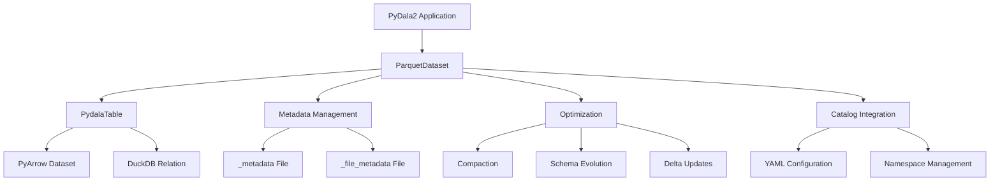

# PyDala2

<p align="center">
  
</p>

[](https://badge.fury.io/py/pydala2)
[](https://opensource.org/licenses/MIT)
[](https://pydala2.readthedocs.io)

**PyDala2** is a high-performance Python library for managing Parquet datasets with advanced metadata capabilities, built on Apache Arrow and DuckDB.

## 🎯 What is PyDala2?

PyDala2 provides a sophisticated dataset management system that combines:
- **Automatic optimization** of Parquet file layouts
- **Intelligent metadata management** with schema evolution
- **Multi-engine query processing** (PyArrow + DuckDB)
- **Production-ready features** like delta updates and time-based operations

## ✨ Key Features

### 🚀 Core Capabilities
- **Smart Parquet Management**: Automatic file optimization, compaction, and layout management
- **Dual Engine Architecture**: Seamlessly switches between PyArrow (fast scans) and DuckDB (complex queries)
- **Advanced Metadata**: Automatic schema unification, statistics tracking, and efficient updates
- **Hive Partitioning**: Native support for partitioned datasets with automatic inference

### 📊 Data Operations
- **Automatic Filter Pushdown**: Intelligently routes queries to the optimal engine
- **Delta Updates**: Merge new data efficiently with change detection
- **Schema Evolution**: Handle schema changes without breaking existing data
- **Time-based Operations**: Built-in support for time series and temporal data

### 🏗️ Production Features
- **Catalog System**: Centralized dataset management across namespaces
- **Cloud Storage**: Native S3 integration with caching and credential management
- **Optimization Operations**: Automatic data type optimization, file compaction, and sorting
- **Robust Error Handling**: Automatic schema repair and graceful degradation

## 🎯 Use Cases

### Data Engineering
```python
# Efficient ETL pipeline
dataset = ParquetDataset("data/sales")
dataset.write_to_dataset(
    new_sales_data,
    mode="delta",
    partition_by=["date", "region"],
    sort_by="timestamp DESC"
)
```

### Analytics
```python
# Complex queries with automatic optimization
result = dataset.filter("""
    date > '2023-01-01'
    AND region IN ('US', 'EU')
    AND amount > 1000
""")
```

### Data Lake Management
```python
# Catalog-based dataset organization
catalog = Catalog("datalake.yaml")
sales = catalog.get_table("sales")
customers = catalog.get_table("customers")
```

## 🚀 Quick Example

```python
from pydala import ParquetDataset
import polars as pl

# Create a dataset (directory auto-created)
dataset = ParquetDataset("data/sales")

# Write data with automatic optimization
data = pl.DataFrame({
    'id': range(1000),
    'date': pl.date_range(start=2023-01-01, end=2023-12-31, interval='1d', eager=True).head(1000),
    'region': ['US', 'EU', 'APAC'] * 333 + ['US'],
    'amount': [i * 10.5 for i in range(1000)]
})

dataset.write_to_dataset(
    data,
    partition_by=["date", "region"],
    max_rows_per_file=100000,
    compression="zstd"
)

# Read and filter - automatic backend selection
result = dataset.filter("amount > 500 AND region = 'US'")
print(result.collect())

# Use SQL directly
sql_result = dataset.ddb_con.sql("""
    SELECT region, COUNT(*) as count, AVG(amount) as avg_amount
    FROM dataset
    GROUP BY region
""").pl()
```

## 🏗️ Architecture



## 📚 Documentation

Our comprehensive documentation covers:

### Getting Started
- [Installation Guide](getting-started.md) - Setup and configuration
- [Quick Start](quick-start.md) - 5-minute tutorial

### User Guide
- [Basic Usage](user-guide/basic-usage.md) - Core operations and patterns
- [Data Operations](user-guide/data-operations.md) - Filtering, aggregation, and transformations
- [Performance Optimization](user-guide/performance.md) - Tuning for production workloads
- [Catalog Management](user-guide/catalog-management.md) - Organizing datasets
- [Schema Management](user-guide/schema-management.md) - Schema evolution and validation

### API Reference
- [Core Classes](api/core.md) - BaseDataset, Config
- [Dataset Classes](api/datasets.md) - ParquetDataset and variants
- [Table Operations](api/table.md) - PydalaTable interface
- [Catalog System](api/catalog.md) - Catalog and namespace management
- [Filesystem](api/filesystem.md) - Storage backends and cloud integration
- [Utilities](api/utilities.md) - Helper functions and tools

### Advanced Topics
- [Deployment Guide](advanced/deployment.md) - Production deployment
- [Performance Tuning](advanced/performance-tuning.md) - Advanced optimization
- [Troubleshooting](advanced/troubleshooting.md) - Common issues and solutions
- [Integration Patterns](advanced/integration.md) - Using PyDala2 with other tools

## 🤝 Contributing

We welcome contributions! Please see our [Contributing Guide](CONTRIBUTING.md) for details.

## 📝 License

[MIT License](LICENSE)